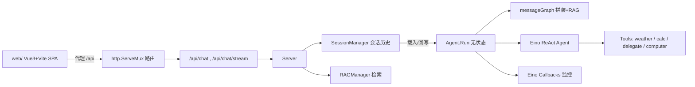

# 硕硕 · 本地多智能体 + RAG

基于 [Eino](https://github.com/cloudwego/eino)（字节 CloudWeGo 开源 AI 应用开发框架）构建的本地智能体应用。
核心能力：**单智能体 ReAct 推理 + 本地 RAG 知识库检索增强 + 基础多智能体委托**，配套一个工程化前端（`web/` 下的 Vue 3 + Vite + TypeScript 单页应用，支持流式对话与 RAG 引用可视化，开发期经 Vite 代理访问后端 `/api`）。

本项目定位为「可编译、并发安全、有测试、有文档」的成熟示例，适合作为简历项目展示
如何在真实框架之上做工程化打磨（而非玩具 Demo）。

---

## 架构总览



### 目录结构

```
Eino/
├── .gitignore                 # 忽略构建产物、data/、.env 等运行时数据
├── README.md                 # 本文档
├── start.bat                 # 一键启动前后端（自动生成 JWT_SECRET、npm install、打开前端）
├── generate_doc.py           # 生成《Eino 框架学习实践报告》（python-docx → Word）
├── data/                     # 运行时数据（已被 .gitignore 忽略）
│   ├── config.json           # 运行时配置（模型/RAG/computer 开关…）
│   ├── agents.json           # 智能体定义
│   ├── sessions/             # 会话历史（自动持久化，重启不丢）
│   └── originals/indexes/…   # RAG 原文与向量索引
├── web/                      # 前端（Vue 3 + Vite + TypeScript，第二阶段新建）
│   ├── index.html            # Vite 入口
│   ├── package.json          # 依赖与 dev/build 脚本
│   ├── vite.config.ts        # 含 /api 代理到后端 :8899
│   ├── tailwind.config.js    # 设计令牌（暗色 OLED + 翡翠绿）
│   └── src/
│       ├── main.ts          # 入口（Pinia + 全局样式）
│       ├── App.vue          # 三栏布局 + 设置抽屉 + Toast
│       ├── style.css        # 全局样式
│       ├── types/           # 与后端契约一致的类型（api.ts 等）
│       ├── api/             # 类型化 API + SSE 流式解析（client.ts 等）
│       ├── router/          # 路由 + 登录守卫（hash 模式）
│       ├── views/           # 页面：Login.vue / Workbench.vue
│       ├── stores/          # Pinia：workspace / chat
│       ├── components/      # 对话、RAG 面板、设置等组件
│       └── utils/           # Markdown 渲染、格式化
└── eino/                    # Go 后端
    ├── main.go               # 启动 + 信号监听 + 优雅关闭
    ├── go.mod                # go 1.26，依赖 Eino v0.7.13
    ├── agent/
    │   ├── agent.go         # 无状态 Agent + messageGraph 拼装
    │   ├── chat.go          # Run / RunStream（按请求传入历史）
    │   ├── manager.go       # 多智能体委托（基础委派，非真协作编排）
    │   ├── types.go         # RunOptions / RunResult / 各类 Trace
    │   ├── tools.go         # 工具注册
    │   ├── computer_tool.go # 本地命令/截图（默认关闭）
    │   └── agent_test.go
    ├── server/
    │   ├── server.go        # Server 装配、路由注册、CORS、超时
    │   ├── routing.go       # ServeMux、CORS 白名单、body 限制、错误包装
    │   └── chat_handlers.go # 会话读写 + 持久化
    ├── auth/                # JWT 鉴权（登录签发、bcrypt、中间件）
    │   ├── auth.go          # 登录/签发 JWT、密码哈希
    │   └── middleware.go    # 受保护路由鉴权中间件
    ├── db/                  # SQLite 存储（modernc，纯 Go 免 CGO）
    │   ├── db.go            # 打开/连接池调优
    │   └── migrate.go       # 表结构迁移（用户/会话…）
    ├── rag/
    │   ├── manager.go       # 文档切片/embedding/检索（逐片控制内存）
    │   └── manager_test.go
    ├── tools/               # 业务工具集合（计算器、格式化等）
    │   └── tools.go
    ├── config/
    │   ├── config.go        # 运行时配置加载（config.json + 环境变量回退）
    │   └── config_test.go
    ├── callbacks/
    │   └── monitoring.go    # 实现 Eino callbacks.Handler 的监控回调
    └── skills/              # 智能体技能（提示词片段）
```

---

## 快速开始

### 0. 一键启动（Windows，推荐）

在项目根目录**双击 `start.bat`**即可：脚本会自动检查并（缺失时）为 `eino/.env` 生成随机 `JWT_SECRET`、首次运行自动 `npm install`、分别拉起后端与前端，就绪后打印并打开前端地址。

```text
前端地址: http://localhost:5173
后端地址: http://localhost:8899
默认账号: admin / admin （首次登录后请尽快修改）
```

> 手动启动见下文第 2、3 步。

### 1. 准备环境

- Go 1.26+（见 `eino/go.mod`）
- Node.js 18+（前端 Vite）
- 一个兼容 OpenAI 的模型接入点（默认对接火山方舟 Ark，也可用 DeepSeek 等）

在 `eino/` 目录创建 `.env`（可复制 `eino/.env.example`；已被 `.gitignore` 忽略，切勿提交密钥）：

```dotenv
# 鉴权（必填！缺失则后端拒绝启动）
JWT_SECRET=用足够随机的长字符串

# Ark（火山方舟）示例
ARK_API_KEY=your-api-key
ARK_ENDPOINT=your-endpoint-id

# RAG 向量检索接入点（与对话可同 Key）
EMBEDDING_EP=your-embedding-endpoint
```

> **`JWT_SECRET` 为必填**：为避免任意请求伪造身份，未配置时后端会 `log.Fatal` 拒绝启动。使用 `start.bat` 时会自动生成。
>
> 模型 / embedding 也可不写 `.env`，直接在前端「设置」页填写并保存（写入 `data/config.json`）。首次启动会自动创建管理员账号（默认 `admin/admin`，可用 `INIT_ADMIN_USERNAME` / `INIT_ADMIN_PASSWORD` 覆盖）。

### 2. 前端（第二阶段）

```bash
cd web
npm install
npm run dev          # 启动 Vite 开发服务器，默认 http://localhost:5173
# 生产构建：
npm run build        # 产出 web/dist/，可静态托管
```

开发期 Vite 已将 `/api` 反向代理到后端 `http://localhost:8899`（见 `web/vite.config.ts`），
因此浏览器直接访问 `http://localhost:5173` 即可联调，无需手动处理跨域。

### 3. 后端编译运行

```bash
cd eino
go build -o eino.exe .        # Windows；其它平台：go build -o eino .
./eino                        # 默认监听 :8899，可传参 ./eino :9000
```

或使用 `go run`：

```bash
cd eino && go run . :8899
```

### 4. 环境变量

| 变量 | 说明 |
| --- | --- |
| `JWT_SECRET` | **必填**，JWT 签名密钥；缺失则后端拒绝启动 |
| `INIT_ADMIN_USERNAME` / `INIT_ADMIN_PASSWORD` | 首次启动时创建的管理员账号（默认 `admin/admin`，仅数据库为空时生效） |
| `RATE_LIMIT_RPS` / `RATE_LIMIT_BURST` | 接口限流（默认 20 RPS / 40 突发，按 userID/IP 双维度） |
| `STREAM_TIMEOUT_SEC` | 流式响应超时秒数（默认 240） |
| `SQLITE_PATH` | SQLite 数据库路径（默认 `data/eino.db`，存会话/用户） |
| `TLS_CERT` / `TLS_KEY` | **可选** HTTPS 证书 / 私钥路径（`PEM` 格式）。两者**同时**配置时后端启用 HTTPS（`https://`），否则退化为明文 HTTP。建议用受信任 CA 签发或反向代理终止 TLS |
| `BACKUP_KEEP` | 备份保留份数（默认 `30`）。`POST /api/admin/backup` 触发后会自动清理更旧的备份，仅保留最新 N 份 |
| `ARK_API_KEY` / `ARK_ENDPOINT` | 模型接入凭证 |
| `EMBEDDING_EP` / `EMBEDDING_MODEL` | RAG embedding 接入点 |
| `CORS_ALLOW_ORIGINS` | 跨域白名单（逗号分隔，如 `http://localhost:5500`；为空时退化为 `*` 本地开发模式） |
| `COMPUTER_TOOLS_ENABLED` | 是否开启本地命令执行（**默认 false**） |

> **模型 / embedding 留空也能跑**：若未配置 `ARK_API_KEY` / `EMBEDDING_EP`，后端与 RAG 仍以「本地模式（local-only）」启动——RAG 使用固定维度的本地轻量向量（语义较弱但可检索、关键词增强），不会崩溃、也不要求联网。在前端「设置」页填入 Key/Endpoint 并保存后，RAG 会自动升级为远程向量，无需重启。远程 embedding 若临时失败会进入 30s 冷却并自动重试，不会因一次抖动永久降级；且进程内所有向量维度统一，避免「本地兜底(256) 与远程(如 1024) 混用导致检索静默失效」。

---

## 本期（第一阶段）工程化改造点

本项目在保留原有分层与 Eino 用法的前提下，完成了以下「成熟度」打磨，
每一项都可单独作为简历中的工程亮点说明：

### 1. 并发安全：Agent 无状态化（核心改造）
- **问题**：原 `Agent` 持有 `history` 共享可变状态（配一把全局锁）。
  多个并发请求会互相穿插、覆盖彼此的对话上下文，导致回复错乱。
- **方案**：`Agent` 不再保存历史，改为无状态 `Run(ctx, history, userMsg, opts) RunResult`。
  会话历史由 Server 按**请求**传入，处理完成后通过 `RunResult.Messages` 交还调用方持久化。
  每个并发请求各自持有独立的消息副本，从根上消除共享状态竞争。
- **会话级锁**：Server 用 `sync.Map` 维护「每会话一把锁」，保证同一会话「读历史 → 运行 → 写回」
  的原子化，而不同会话之间仍可并行，兼顾正确性与吞吐。

### 2. 会话持久化
- 复用 `SessionManager`，每次对话后自动 `SetMessages + Save`。
- 服务重启不会丢失历史上下文；前端不传 `sessionId` 时自动退化为「每 Agent 一个会话」，
  与改造前体验一致（向后兼容）。

### 3. HTTP 层加固
- 用 `http.NewServeMux` + 独立的 `http.Server` 替代全局默认 mux。
- 设置 `ReadTimeout / ReadHeaderTimeout / WriteTimeout / IdleTimeout`，并对
  `/api/chat`、`/api/chat/stream` 使用 `http.MaxBytesReader`（1MB）限制请求体，防异常大请求拖垮服务。
- 监听 `SIGINT/SIGTERM` 进行优雅关闭（15s 超时等待在途请求完成）。
- CORS 改为**可配置白名单**（环境变量 `CORS_ALLOW_ORIGINS`），命中时回显 Origin，
  避免使用 `*` 通配带来的凭据风险。
- 错误响应统一包装为「internal server error」，服务端日志保留细节，**不向客户端泄露 API Key / 端点**。

### 4. UTF-8 截断修复
- 原代码用 `value[:n]` 按**字节**截断，遇到中文等多字节字符会切断 rune，产生乱码/非法 UTF-8。
- 新增 `truncateRunes`（基于 `[]rune`）替换所有截断点：RAG 文档入库、上下文拼接、引用摘要、命令输出等。
- 注：初次复查中提到的 `body.Len()` 误用经核实并非编译错误（`strings.Builder.Len()` 合法），
  真正的隐患是上面的字节截断，已修复。

### 5. 死代码清理
- 删除未被引用的 `eino/workflow/graph.go`（实验性、未接入模型）。
- 删除 `config.GetAll()` 中写死的「李硕」Agent 等无用代码；配置统一来自 `data/config.json` 或环境变量。
- 移除 `Agent` 上未使用的 `toolsNode` / `toolInfos` / `history` / `mu` 字段。

### 6. 真实接入 Eino Callbacks 监控
- `callbacks/monitoring.go` 由示例级代码改造为**真正实现 `eino/callbacks.Handler` 接口**的监控处理器
  （`OnStart` / `OnEnd` / `OnError` + 流式变体）。
- 在 `Agent.Run` 中通过 `callbacks.InitCallbacks(ctx, &RunInfo{}, handler)` 注入，
  随组件执行自动触发，可记录每一步耗时、错误，便于排查与后续接入指标。

### 7. 安全默认
- `config.ComputerToolsEnabled` 默认 `false`，且 `Server.wireAgentTools` 始终按该开关配置
  `ComputerPolicy`；未显式开启时   `computer_action` 与本地命令执行不可用，避免联网部署风险。

---

## 本期（第二阶段）前端工程化

将原本的「单文件 `web/index.html`」重写为**工程化前端**，贴合第一阶段已稳定的后端契约：

### 1. 技术栈
- Vue 3（`<script setup lang="ts">`） + Vite + TypeScript
- Pinia（状态管理：`workspace` / `chat` 两个 store）
- Tailwind CSS（暗色 OLED 主题 + 翡翠绿强调，Fira 字体）
- `marked` + `DOMPurify`（Markdown 安全渲染）+ `highlight.js`（代码高亮）
- `lucide-vue-next`（图标，全程 SVG，未使用 emoji）

### 2. 三栏工作台
- **左栏**：品牌、新建对话、智能体切换、会话列表（本地持久化于 `localStorage`）、RAG 启用状态、设置入口。
- **中栏**：流式对话（SSE 增量渲染 Markdown）、空态建议、RAG 参数条（回答模式 / TopK / 仅用资料 / 来源筛选 / 最低分）、输入区（Enter 发送、Shift+Enter 换行、流式时一键停止）。顶栏另含「协作」入口，可将当前任务委派给另一智能体（基础委托 `/api/collaborate`）。
- **右栏**：RAG 与执行追踪可视化，分段切换「引用 / 工具 / 追踪」；引用卡展示文件名、切片编号、相似分与片段，随 SSE 事件实时刷新。

### 3. 流式链路
- `api/client.ts` 通过 `fetch` + `ReadableStream` 手动解析 SSE（`event: <type>\ndata: <json>\n\n`），
  与 `eino/server/chat_handlers.go` 的 `handleChatStream` 输出逐字段对齐：
  `status` → 状态提示；`meta` → 检索问题 / 引用 / 工具 / 追踪；`delta` → 增量正文；`done` → 终稿与完整元数据；`error` → 错误提示。
- 发送后乐观追加用户/助手两条消息，助手占位随 `delta` 增长，结束事件回填引用与追踪，并自动更新会话列表预览。

### 4. 管理视图（设置抽屉）
- **RAG 管理**：资料块 / 来源数 / 状态概览；文本或文件上传建索引；目录扫描（含目录浏览器）；检索测试；Embedding 连通性测试。
- **智能体**：列表 + 新建 / 编辑 / 删除（热重载生效）。
- **设置**：API Key（仅写 `.env`，不回显）、对话 TopK、最低相似分、来源筛选、严格仅用资料、计算机工具开关；保存后服务端热重载。
- **系统**：运行时内存概览、手动 GC、待审批的本地命令处理。

### 5. 响应式与细节
- 桌面端三栏常驻；窄屏下左栏转为抽屉（顶栏菜单按钮 + 遮罩），右栏可开合。
- 全局 Toast、加载/流式光标、空态引导、聚焦与悬停态、滚动条暗色化，均按生产级 UI 规范实现。

---

## 测试

使用 Go 标准 `testing`，覆盖本次改动的关键逻辑：

```bash
cd eino && go test ./...
```

- `agent/agent_test.go`：UTF-8 截断、消息深拷贝隔离、历史裁剪、回答模式归一化。
- `rag/manager_test.go`：rune 截断、空结果上下文拼接。
- `config/config_test.go`：配置默认值、保存时 API Key 不落盘（`SaveRuntimeConfig` 会清空密钥）。

---

## 部署前安全建议

- **密钥管理**：`JWT_SECRET` / `ARK_API_KEY` / `EMBEDDING_EP` 等一律通过环境变量或 `.env` 注入；`.env` 与 `.env.*` 已被 `.gitignore` 忽略（仅 `.env.example` 入库供复制），切勿把真实密钥提交进版本库。生产环境建议使用系统密钥管理（如云厂商 Secret Manager / systemd `EnvironmentFile` / k8s Secret）而非明文 `.env`。
- **初始管理员**：未设置 `INIT_ADMIN_PASSWORD` 时，后端会为 `admin` 账号**随机生成 16 位强密码并在启动日志打印一次**（非默认 `admin/admin`）。请上线前显式配置强密码，并在首次登录后于设置页修改。
- **跨域**：`CORS_ALLOW_ORIGINS` 务必显式填前端域名。配置为空时本地退化为 `*` 且仅在不携带凭据的模式下可用；**不要**把 `*` 与凭据并用，否则存在跨站凭据泄露风险。
- **计算机工具**：`COMPUTER_TOOLS_ENABLED` 默认 `false`，联网部署请勿开启，避免本地命令执行暴露。
- **传输加密**：对外暴露时务必启用 `TLS_CERT`/`TLS_KEY` 启用 HTTPS，或在反向代理（Nginx/Caddy）层终止 TLS、后端走内网明文。本地自用可保持 HTTP。

### 数据备份与恢复

数据文件集中在后端 `data/`（SQLite `eino.db`、对话会话 `sessions/`、`config.json`、`agents.json`）以及项目根 `.env`（含商家 API Key）。建议**定期备份**，避免误删或磁盘损坏导致对话/用户/审计记录丢失。

**在线一致性备份（推荐）**：后端用 SQLite 原生 `VACUUM INTO` 生成快照，**服务端运行时也能安全执行**（不锁库、不损坏目标库），每次产出 `data/backups/<YYYYMMDD-HHMMSS>/`，内含 `eino.db` + 其余运行时文件 + `.env`（尽力）。

- 手动触发：`POST /api/admin/backup`（管理员令牌），或 `GET /api/admin/backups` 查看已有备份。
- 自动轮转：保留最新 `BACKUP_KEEP`（默认 30）份，超出自动清理。
- 定时任务（Windows）：项目内置 `eino/scripts/backup.ps1`，登录管理员后调用上述接口；可用“任务计划程序”注册每日 03:00 运行：
  ```powershell
  $action  = New-ScheduledTaskAction -Execute "powershell.exe" -Argument "-NoProfile -ExecutionPolicy Bypass -File `"$PSScriptRoot\backup.ps1`""
  $trigger = New-ScheduledTaskTrigger -Daily -At "03:00"
  Register-ScheduledTask -TaskName "EinoBackup" -Action $action -Trigger $trigger -User "SYSTEM" -RunLevel Highest
  ```

**恢复**：停止后端后运行 `eino/scripts/restore.ps1`，按提示选择备份序号并输入 `YES` 确认，脚本将原样复制回 `data/`。恢复不可逆，请先确认已停止进程。

> 备份目录含 `.env` 等敏感信息，请与 `data/` 一并限制文件系统访问权限；不要把备份目录提交进版本库。

---

## 已知边界与后续路线

| 阶段 | 范围 | 状态 |
| --- | --- | --- |
| 第一阶段（本期） | 后端精准打磨：并发安全、死代码、UTF-8、HTTP 加固、持久化、测试/文档 | ✅ 完成 |
| 第二阶段（本期） | 正规前端（Vue 3 + Vite + TS，流式对话 + RAG 引用可视化 + 管理视图） | ✅ 完成 |
| 第三阶段 | 基于 Eino compose.Graph 的多智能体协作编排（router / supervisor 模式） | ✅ 完成 |

### 第三阶段：多智能体协作编排（基于 Eino compose.Graph）

把"单智能体 + RAG"升级为**可编排的多智能体系统**，两种拓扑都跑在 Eino 的 `compose.Graph` 之上：

- **Router（规划-并行-汇聚）**：LLM 先拆解任务并分配子智能体 → 多个 ReAct 子智能体**并发**执行 → 协调者 LLM 汇聚成最终回答。
- **Supervisor（主管循环）**：主管 LLM 每轮决策"委派哪个子智能体 / 是否结束" → 子智能体执行 → 观察回灌主管上下文 → 循环，直到判定完成或达到步数上限（防无限循环）。

子智能体本身仍是 Eino ReAct 图（`Agent.RunStream`），编排层只负责**拆解 / 调度 / 汇聚**，不重复造轮子。前端顶栏可一键切换拓扑，并实时渲染"编排时间线"（规划拆解 → 各子智能体执行 → 合成）。

**新增/改动文件：**
- 后端 `eino/agent/orchestrator.go`（新增）：`Orchestrator` + 两种拓扑的 `compose.Graph` 构建与执行、`plan`/`synthesize`/`supervisorLoop`、并发安全的 `safeEmitter`。
- 后端 `eino/agent/types.go`：为 `StreamEvent` / `ExecutionTraceItem` 增加拓扑/阶段/子任务字段，新增 `SubTaskInfo`。
- 后端 `eino/agent/chat.go`：新增 `Agent.Generate`（纯 LLM，供规划/合成）。
- 后端 `eino/server/chat_handlers.go`、`server.go`：`/api/chat/stream` 与 `/api/chat` 增加 `topology` / `agents` 参数与编排分支；`Server` 持有 `Orchestrator`。
- 前端 `web/src/types/api.ts`、`api/client.ts`：编排类型与 `chatStream` 参数。
- 前端 `web/src/stores/chat.ts`：拓扑状态、参与智能体、实时编排时间线消费。
- 前端 `web/src/components/TopologySwitcher.vue`（新增）、`OrchestrationTimeline.vue`（新增），并接入 `ChatView` 顶栏与 `ChatMessage` 气泡内联时间线。

**用法**：设置里至少配置 2 个智能体 → 对话顶栏切到 Router / Supervisor → 勾选参与智能体（空=全部）→ 发送任务。

### 架构讲法与面试 QA（分层口径）

| 层 | 是什么 | 谁做的 |
| --- | --- | --- |
| 基础设施层 | Eino 的 `compose.Graph` / `react` agent / `schema` / `callbacks` | 开源框架（CloudWeGo），我**选型并接入** |
| 业务编排层 | 多智能体拓扑（Router/Supervisor）、子任务拆解、结果汇聚、前端时间线 | **我写的** |
| 工作台层 | 会话持久化、HTTP 服务、RAG 接入、工具、前端 | **我写的** |

**高频问答口径：**
1. *为什么用 Eino 的 Graph 而不是自己写调度循环？* → 框架原生支持并发/可观测/回调，我没重复造 ReAct 与工具分发那套；编排骨架就是一张 `compose.Graph`，调度语义（并行/循环）由编排层驱动各 ReAct 子智能体。
2. *Router / Supervisor 在 Graph 里怎么表达？* → Router 是标准 DAG（planner → executor → synthesizer）；Supervisor 用 supervisor 节点内 `for` 循环驱动 `plan → delegate → 观察回灌` 直到终止，外层仍挂在 `compose.Graph` 上。子智能体集合是**配置期动态**的，不适合编译期静态展开为固定节点，故并行/循环放在节点内用 Go 原语驱动，这是真实工程取舍。
3. *子智能体之间的上下文/记忆怎么隔离？* → 每个子智能体以**独立空历史**运行（与 `DelegateTask` 一致），只有必要上下文（子任务描述）传入，互不污染。
4. *Supervisor 会无限循环吗？* → 不会：`MaxSteps` 步数上限（默认 6）+ LLM 返回 `{"finish":true}` 作为终止条件。
5. *子任务失败/超时怎么办？* → 单子智能体错误向上抛出并终止本轮编排，前端以错误事件回显；后续可加重试/降级。
6. *多智能体并发调 LLM 的成本/延迟？* → Router 并行摊薄延迟；Supervisor 串行多轮更适合需依赖前序结果的任务。

---

## 主要依赖

- [cloudwego/eino](https://github.com/cloudwego/eino) `v0.7.13`：`react` agent、`compose` graph、`callbacks`、`schema`
- 模型接入：Ark / OpenAI 兼容；embedding：火山方舟 embedding 端点
- HTTP：Go 标准库 `net/http`（未引入 Web 框架）
- 前端：`web/`（Vue 3 + Vite + TypeScript + Tailwind + Pinia；`marked` / `DOMPurify` / `highlight.js` / `lucide-vue-next`）
